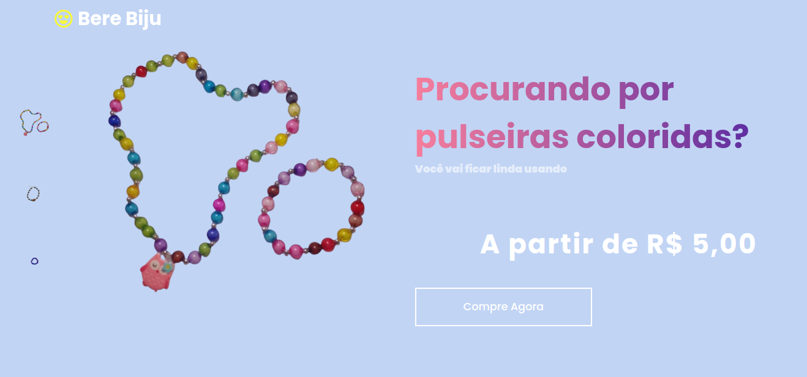
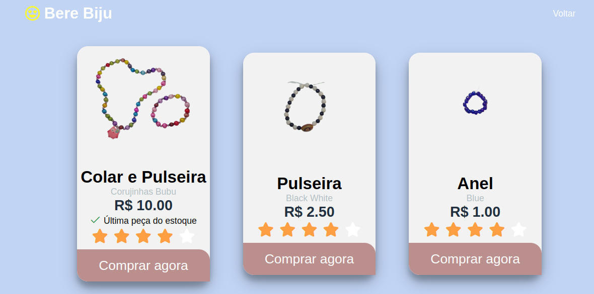
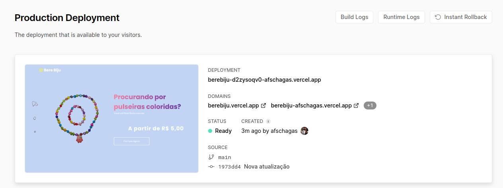

  
  
   

<h1 align="center">Bere Biju</h1>

Eu e minha filha estamos trabalhando num projeto pai e filhinha. 😃 O trabalho dela é me passar a cor certinha das miçangas...

# Como funciona...

 
Ao clicar sobre o botão Comprar agora, o sistema gera um número de pedido com nome, descrição e preço do produto. Disparando o pedido para o WhatsApp da minha filha.

<h3 align="center">
    <a href="https://developer.mozilla.org/pt-BR/">🔗 HTML | CSS | JavaScript</a>
</h3>

🚀 As interfaces do usuário foram criadas com HTML, CSS e JavaScript puro.

# Status do Projeto

<h4 align="center"> 
	 🚀 Em construção...  🚧
</h4>

# Demonstração da aplicação

<h3 align="center">
    <a href="https://berebiju.vercel.app/">🔗 Bere Biju - Vercel</a>
</h3>

<h1 align="center">
  
</h1>
